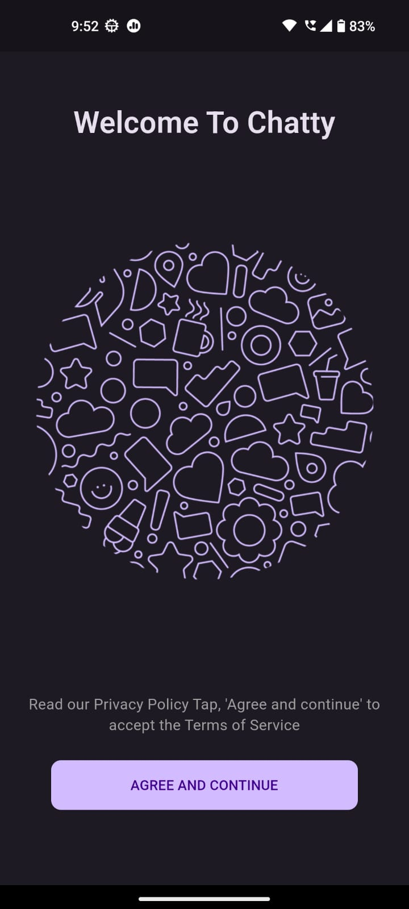

# Chatty

Chatty - A chatting application, made in flutter, designed with Material 3. Also uses firebase for login/account creation using phone number.

## Features

- Material You design theme: Customizable and visually appealing user interface. [Learn more](https://m3.material.io/).
- Login/Create account using your phone number.
- Chat with your contacts who also have an account on the app.
- Send photos, videos, gifs, voice messages in chats.
- Reply to messages, along with a handy message-preview.
- Make and chat in Group Chats.
- Post stories/statuses that disappear after 24 hours and are only visible to your contacts.

## Screenshots

    <br>
    

## Installation

After cloning this repository, navigate to the `chatty` folder. Then, follow these steps:

1. Create a Firebase project.
2. Enable authentication methods such as Google Sign-In and Guest Sign-In.
3. Configure Firestore rules to secure your database.
4. Create Android and iOS apps in the Firebase project.
5. Use the FlutterFire CLI to add the Firebase project to this app.

Finally, run the following commands to start the app:

```bash
flutter pub get
open -a simulator
